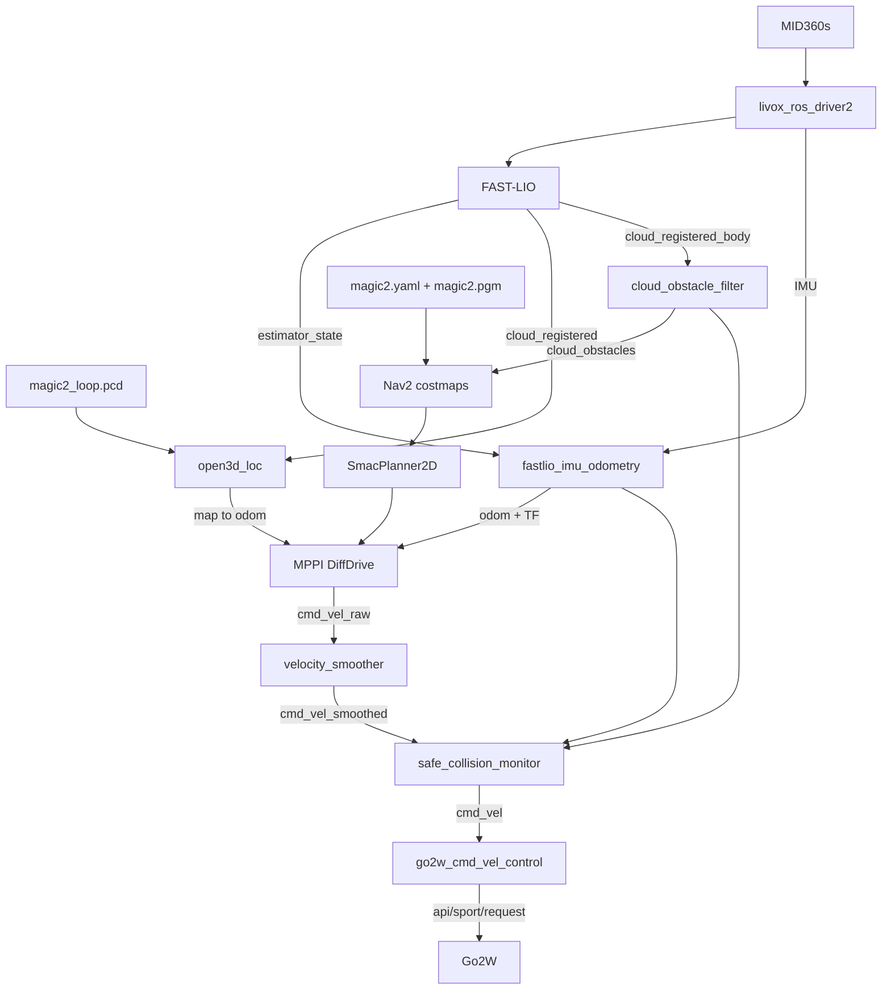

# 整体架构

状态基线：2026-09-20。部署入口见 [README](../README.md)。

## 源码职责

| 目录 | ROS 包 / 职责 |
| --- | --- |
| `src/livox_ros_driver2` | MID360s 驱动；发布雷达点和 IMU |
| `src/ws_fastlio2` | `fast_lio`：激光惯性前端；导出修正状态供 IMU 传播 |
| `src/fastlio_loop` | 关键帧、回环配准、Ceres 位姿图和优化地图保存 |
| `src/open3d_loc` | 实时点云与已有 PCD 配准，提供全局定位修正 |
| `src/go2w_nav2_navigation` | 预测里程计、障碍点过滤、自定义碰撞监控、Nav2 配置与启动 |
| `src/go2w_nav2_bridge` | 运动模式管理、输入健康检查、Unitree Sport API 转换 |
| `third_party/Livox-SDK2` | 驱动所需 SDK 源码；本机编译产物不提交 |
| `maps` / `waypoints` | 地图资产 / 以 `map` 为坐标系的命名点位 |
| `scripts` / `reports` | 运维检查和地图转换工具 / 历史变更与验证证据 |

## 导航数据流

`start_nav.sh` 默认不启动最后的运动桥接和运动模式管理器；`--motion` 才启动。
`/scan_2d` 用于可视化或其他消费者；当前代价地图直接使用 PointCloud2。
原始机身点云还用于清障射线，未观测区域不会自动当作自由空间。

## TF 所有权

导航主链为 `map -> odom -> base_link`，静态 TF 连接 `lidar_link -> livox_frame`。
机身到内部 IMU 的外参由预测和点云转换节点参数使用，当前静态 launch 不发布 `imu_link`。

| 变换/输出 | 发布者 | 含义 |
| --- | --- | --- |
| `map -> odom` | `open3d_loc` | PCD 全局配准修正，跟随预测里程计时间发布 |
| `odom -> base_link`、`/odom` | `odom_prediction` | FAST-LIO 修正状态加有界 IMU 传播，目标 50 Hz |
| `camera_init -> body`、`/Odometry` | FAST-LIO | 前端内部里程计链，不是导航机身中心链 |
| `base_link -> lidar_link -> livox_frame` | `mid360_mount.launch.py` | 机身到雷达及驱动坐标系的静态关系 |

旧 `fastlio_odom_bridge` 仍保留在源码中，当前导航 launch 使用 IMU 预测节点，
不能同时启动二者发布同一 `odom -> base_link`。
预测健康话题 `/odom_prediction/valid`、定位置信度和障碍新鲜度用于阻止无效输入下运动。

建图入口 `fastlio_loop/mapping_loop.launch.py` 使用 `map -> camera_init -> body`。
建图的 map 修正由回环后端发布，不应与导航定位同时运行。

## 当前关键配置

配置依据：`src/go2w_nav2_navigation/config/nav2_go2w.yaml` 和同包 launch。

| 项目 | 当前值 |
| --- | --- |
| 默认二维 / 三维地图 | `magic2.yaml` / `magic2_loop.pcd` |
| 机身轮廓 | 0.75 × 0.45 m，padding=0 |
| 全局 / 局部膨胀 | 0.40 / 0.30 m |
| MPPI 前进 / 倒车 / 转向上限 | 0.60 m/s / -0.18 m/s / 0.70 rad/s |
| 控制频率 / 预测时域 | 10 Hz / 32 × 0.1 s |
| 运动桥前进硬限幅 | 0.75 m/s，不代表规划器目标速度 |
| 障碍高度（机身坐标） | 0.05～0.80 m |
| 自车点剔除范围 | x ±0.44 m，y ±0.26 m |
| 红色急停区 | x [-0.48, 0.50] m，y ±0.30 m；单点触发 |
| 橙色保护范围 | 随实际/目标速度及制动模型动态变化；MarkerArray 显示 |

橙色模型检查直行、转弯前后角扫过和倒车空间，按剩余空间限速并平滑恢复。
红色急停优先。当前制动参数尚需实机标定，详见
[动态减速验证](../reports/dynamic_slowdown_20260920/README.md)。

## 地图与点位

二维地图用于规划，三维地图用于定位，必须处于一致坐标系。
点位文件中的 `map_yaml` 相对 JSON 所在目录，`yaw_deg` 是平面朝向角。
保存工具只订阅 `/waypoint_pose`，导航工具通过 `/navigate_to_pose` action 发送目标。
导航前校验地图文件路径，但不能识别同一路径下内容已被重建的地图。

进一步阅读：[地图说明](../maps/README.md)、[点位说明](../waypoints/README.md)、
[TF 验证](../reports/tf_prediction_20260920/README.md)。
