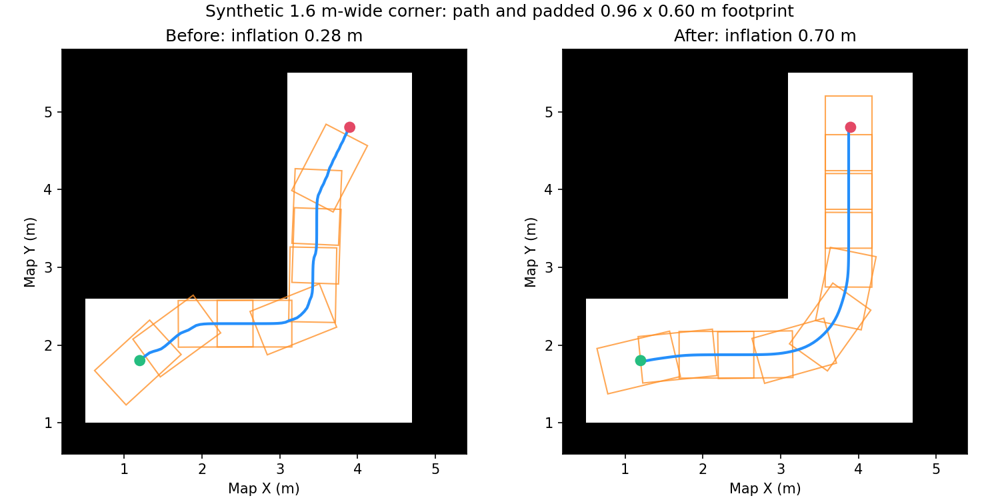

# Go2W 建图、定位与导航优化报告

**报告日期：2026-09-20**  
**项目：MID360s + FAST-LIO + 回环后端 + Open3D 定位 + Nav2 + Unitree Go2W**  
**工作空间：`/home/koala2/nav_ws`**  
**时间口径：北京时间，Asia/Shanghai，按日归档。**

本报告汇总当前会话中的建图、地图生成、导航调参和时序优化。每项按照“出现的问题—原因分析—优化措施—验证结果与当前状态”记录。

## 1. 日期依据与整体进展

日期优先依据带日期的验证报告、构建日志、配置备份和提交记录。早期对话本身没有提供逐条消息日期，因此部分工程接入工作按成果文件日期归档，**不将文件修改日期等同于用户首次发现问题的日期**。

| 日期 | 当日可核实的主要工作 | 日期依据 |
|---|---|---|
| 2026-09-17 | 驱动与 FAST-LIO 构建；安装外参接入；回环后端；二维地图生成；导航入口及网口配置 | 当日构建/测试日志、回环说明、地图报告；接入与网络部分按成果文件日期归档 |
| 2026-09-18 | 回环包独立发布；JSON 点位；墙角避障；速度与动态障碍响应；窄通道参数；目标终止诊断 | 发布副本提交记录、当日配置备份、验证报告及会话诊断记录 |
| 2026-09-19 | 没有找到可核实的当日优化记录 | 不补写未发生或无法确认的工作 |
| 2026-09-20 | 膨胀半径调整；矩形检查与安全框方案评估；TF、定位状态与里程计工程化优化 | 当前会话、源代码、当日备份、编译与测试结果 |

目前已经形成从建图、回环优化、二维地图生成，到定位、路径规划、局部控制、碰撞监控和底盘接口的完整链路。已完成的代码和配置修改有离线验证依据；**真实场地通行成功率、制动距离和全链路延迟尚未完成统一验收**。

## 2. 2026-09-17：建图与导航基础链路完善

### 2.1 雷达和机器狗网络接入

**出现的问题**

早期需要确认 MID360s 的实际 IP 和连接网口；后续导航出现“发出目标但机器狗不动”，用户说明机器狗通过 USB 转网口连接 Jetson。

**为什么会出现**

雷达和机器狗使用不同网段。此前机器狗网段地址曾配置在雷达所在的 `eno1` 上，与实际 USB 网口接线不一致，影响面向机器狗的路由和 DDS 通信。能看到雷达点云不能证明机器狗控制链已连通。

此外，`enable_motion:=false` 是检查模式，本来就不会启动底盘运动链路；它与网络故障是不同原因。

**怎么优化**

明确两张网卡职责并固化 NetworkManager 配置：

| 连接对象 | Jetson 网口 | Jetson 地址 | 对端地址 |
|---|---|---|---|
| MID360s | `eno1` | `192.168.1.6/24` | `192.168.1.195` |
| Go2W | `enx00e04c356b10`，USB 网口 | `192.168.123.99/24` | 常用本体地址 `192.168.123.161` |

通过 `scripts/configure_go2w_network.sh` 保存旧配置、修正地址和路由、进行连通性检查。导航环境将 CycloneDDS 默认绑定到机器狗 USB 网口。脚本检测到本工作空间的底盘控制节点仍在运行时拒绝修改网络。

**验证结果与当前状态**

用户回传的雷达检查显示 `192.168.1.195` 三次 ping 全部成功、丢包率 0%；分网口配置输出显示到雷达和机器狗的路由分别走正确网口，机器狗地址也有成功响应。现有脚本和环境入口已保留该接线方案。网络连通性检查不等同于底盘完整运动验收。

日期说明：本节按 2026-09-17 的网络脚本和环境文件归档；首次雷达排查的精确日期无法仅凭早期对话确认。

依据：[网络配置脚本](../scripts/configure_go2w_network.sh)、[网络说明](../scripts/README.md)、[环境入口](../setup_go2w_navigation.sh)。

### 2.2 构建、动态库环境与启动入口

**出现的问题**

需要编译 Livox 驱动和 FAST-LIO；每次手动输入 Livox SDK 的动态库路径容易遗漏；导航启动命令包含环境、二维地图、三维地图和运动开关，使用复杂。

**为什么会出现**

Livox SDK 使用工作空间内的安装路径，运行环境必须能找到其动态库。导航同时依赖雷达、里程计、三维定位、Nav2 和 Unitree 消息包，分散手动启动容易遗漏步骤或加载其他工作空间中的同名包。

**怎么优化**

完成驱动与前端构建；将 Livox SDK 路径和 ROS 环境统一纳入 `setup_go2w_navigation.sh`，只复用原工作空间中的 Unitree 消息包。新增 `start_nav.sh`，自动选择 `magic2.yaml`、`magic2_loop.pcd` 和 RViz：默认关闭运动，`--motion` 开启导航底盘接口。

**验证结果与当前状态**

2026-09-17 构建日志记录 `livox_ros_driver2`、`fast_lio` 成功，用户确认已出现点云。当日后续构建中 `go2w_nav2_bridge`、`open3d_loc` 也成功。SDK 路径随统一环境入口加载，日常启动不必重复手输 `LD_LIBRARY_PATH`。

依据：[启动脚本](../start_nav.sh)、[环境入口](../setup_go2w_navigation.sh)、[构建日志](../log/build_2026-09-17_16-52-01/events.log)、[定位与底盘桥构建日志](../log/build_2026-09-17_23-16-53/events.log)。

### 2.3 安装外参和坐标转换统一

**出现的问题**

用户提供 `2.pdf`，说明其中包含 MID360s 与 Go2W 的相对安装位姿。导航需要正确把雷达/IMU 位姿和障碍点转换到机身坐标系。

**为什么会出现**

雷达安装坐标、雷达内部 IMU 坐标和机器狗机身坐标不是同一个坐标系。混用机身安装角度与雷达—IMU 内部外参，会导致点云高度、机身位置和碰撞检查不一致。安装外参不一致是需要消除的误差源，但不能据此认定它是所有建图漂移的唯一原因。

**怎么优化**

按已有安装图接入 `base_link → lidar_link`：平移 `[0.29079, 0, 0.15633] m`，俯仰角 `30°`。保留 FAST-LIO 原有雷达—IMU 内部外参，推导 `base_link → imu_link`：平移 `[0.278256279, 0.023290, 0.112620959] m`，俯仰角 `30°`。

机身里程计转换、点云转换与定位采用一致的安装关系。导航主 TF 链保持 `map → odom → base_link`；安装外参使用静态 TF。代码中避免同时从 `map` 和 `base_link` 给 `motion_link` 设置两个父坐标系。

**验证结果与当前状态**

外参已接入当前配置和转换节点。图纸提供的是机身安装关系，不能替代雷达—IMU 内部标定；本报告不将安装图接入等同于完成全部传感器标定。此项按当日代码与构建成果归档。

依据：[安装 TF](../src/go2w_nav2_navigation/launch/mid360_mount.launch.py)、[导航说明中的外参推导](../src/go2w_nav2_navigation/README.md)、[安装图](../2.pdf)。

### 2.4 绕行回到起点后地图错位：增加回环优化

**出现的问题**

用户反馈同一片区域投影后不重合，点云与地图逐渐偏离，走一圈回到起点后与原地图错开。

**为什么会出现**

FAST-LIO 前端提供局部激光惯性里程计，运动过程中误差会累计。仅依靠前端里程计，无法自动利用“重新经过同一地点”的信息约束整段历史轨迹。传感器初始化、时间同步、外参和环境几何退化也可能影响漂移。

**怎么优化**

新增独立 `fastlio_loop` 后端：提取关键帧，搜索历史回环候选，使用多级点云配准、重叠率、RMSE、几何可观测性和重复确认过滤候选；回环通过后进行 Ceres SE(3) 位姿图优化，按优化位姿重新拼接历史关键帧。

主要默认条件：关键帧平移约 `0.75 m` 或旋转约 `14°`；回环相隔至少 `25` 个关键帧和 `30 s`；候选搜索半径 `8 m`；需要两个关键帧一致确认。建图入口增加至少 `2 s` 连续静止 IMU 初始化检查。

前端保持连续运行，后端不直接跳变前端滤波器状态。通过 `/map_save` 保存优化地图、原始与优化位姿、关键帧及约束；默认拒绝覆盖已有地图。

**验证结果与当前状态**

当日 `fast_lio`、`fastlio_loop` 编译通过，最终 `10` 项核心测试通过。独立 ROS 域合成绕行包含 `43` 个关键帧，产生 `1` 次回环，地图、轨迹、里程计、TF 和保存保护检查通过。用户随后确认完成重新建图，现有地图文件为 `magic2_loop.pcd`。

合成回环成功不能证明当前实测地图所有漂移均已消除；现有记录也不足以替代该次实机建图的回环统计。回环候选不足、几何退化、重复结构或初值偏差过大时，仍可能无法闭环。

依据：[回环后端说明](../src/fastlio_loop/README.md)、[回环参数](../src/fastlio_loop/config/backend.yaml)、[最终核心测试日志](../log/test_2026-09-17_21-57-49/events.log)。

### 2.5 平地场景二维地图质量差：改用局部地面高度投影

**出现的问题**

用户明确场地同层、无坡度，但 PCD 投影得到的二维地图不理想，存在区域显示不完整或不重合的问题。

**为什么会出现**

实际场地平坦，不等于建图结果的世界 Z 完全水平。现有地图报告中，轨迹 Z 范围约为 `-2.636～0.072 m`，表明数据仍有明显高度变化。使用单一世界 Z 切片，可能在不同位置把地面误当障碍，或把真实障碍排除。

需要区分两种问题：局部高度筛选不合理可以通过投影改进；SLAM 的水平重影和错位必须从建图、定位本身处理。

**怎么优化**

完善 `scripts/pcd_to_2d_map.py`：利用优化轨迹附近的地面回波估计传感器离地高度，建立局部地面基准，再按相对地面高度提取障碍。

本次生成参数为：相对地面高度 `0.15～1.50 m`、分辨率 `0.05 m`；地面观测形成自由区域，障碍形成占用区域，无观测区域保留未知；加入采样间隙补偿和孤立障碍过滤，输出 PGM、YAML、预览图和生成参数报告。保留原 PCD 与 XY 坐标。

**验证结果与当前状态**

生成报告记录输入 `357,410` 个点，输出地图 `1074 × 1106` 栅格、原点 `[-9.5, -43.0, 0]`；传感器离地高度估计约 `0.552 m`。用户之后完成二维地图人工修饰，导航使用其修改后的 `magic2.pgm`。

生成报告中的占用/自由栅格统计属于生成时结果，不能直接当成人工编辑后地图的统计。预览 PNG 也不能代替当前 PGM。局部高度投影没有修复三维地图的水平变形或累计漂移。

依据：[生成脚本说明](../scripts/README.md)、[地图生成参数报告](../maps/magic2.report.json)、[当前地图 YAML](../maps/magic2.yaml)。

## 3. 2026-09-18：导航通行与动态响应优化

### 3.1 点位无法复用、RViz 工具用途混淆

**出现的问题**

用户希望把 RViz 目标点保存为 JSON，并通过文件维护、按名称导航；之后出现“RViz 给了目标点却没有规划路线”。

**为什么会出现**

一次性目标缺少持久化管理。新增记录点位工具后，`2D Goal Pose` 的 `/waypoint_pose` 与真正调用导航 action 的 `Nav2 Goal` 用途不同；使用仅用于保存点位的工具，不会自动生成导航任务。

**怎么优化**

新建 `waypoints/`，使用 `magic2_goals.json` 保存地图关联、`map` 坐标系和命名点位。新增 `save_waypoint.sh`、`goto_waypoint.sh` 及配套脚本：支持记录/替换点位、列出点位、离线检查、比对加载地图路径、转换朝向、发送 `/navigate_to_pose` 目标并显示执行结果。

保存操作只订阅点位、写入 JSON；实际导航由按名称发送脚本或 RViz 的 `Nav2 Goal` 发起。保存时进行输入校验并使用锁和原子写入，降低误覆盖风险。

**验证结果与当前状态**

工具和说明已落地，进行了离线检查。保存点位与执行目标的操作区别已明确。初始点位文件为空，不虚构实际目标坐标；地图重建后需要重新采集点位。该问题归类为目标提交链路和使用方式，不归类为规划算法完全失效。

依据：[点位使用说明](../waypoints/README.md)、[点位保存脚本](../scripts/save_waypoint.py)、[点位导航脚本](../scripts/goto_waypoint.py)。

### 3.2 机器狗卡在墙角：规划余量与控制负载调整

**出现的问题**

机器狗能够开始移动，但在拐角处停住。用户确认左前方障碍点来自真实墙壁。

**为什么会出现**

现场采样 `85` 帧中 `82` 帧有点进入红色停止区，示例机身坐标约为 `(0.292, 0.299, 0.573) m`。此时停止有真实墙壁触发依据。

原全局/局部膨胀半径为 `0.28/0.25 m`；加余量后矩形机身为 `0.96 × 0.60 m`，半对角线约 `0.566 m`。Humble MPPI 的部分轮廓检查依赖中心代价和膨胀场，半径过小可能使矩形角部碰撞未被充分检查。二维全局路径还可能贴近墙角。

同时存在起点位于高代价区域、20 Hz 控制周期超时、RotationShim 按当前时刻查询 TF 的未来外推错误。

**怎么优化**

这一轮扩大膨胀半径至全局 `0.70 m`、局部 `0.65 m`，全局 `cost_travel_multiplier` 调为 `2.5`，让路径更早绕开墙角；保留矩形轮廓、padding 和碰撞惩罚。

控制器改为直接使用 MPPI，移除 RotationShim 这一额外 TF 查询环节；控制频率从 `20 Hz` 调为 `10 Hz`，采样规模从 `48 步 × 1600 条` 调为 `32 步 × 1000 条`，步长从 `0.05 s` 调为 `0.10 s`。按配置计算，预测时域从 `2.4 s` 改为 `3.2 s`。当时前进上限暂降至 `0.35 m/s`，优先验证转角行为。

**验证结果与当前状态**

独立 ROS 域 186，在合成 `1.6 m` 宽直角走廊中使用真实 SmacPlanner2D 规划，并检查沿路径切线摆放的矩形：

| 指标 | 修改前 | 当轮修改后 |
|---|---:|---:|
| 加密路径检查样本 | 548 | 608 |
| 矩形覆盖障碍的样本 | 140 | 0 |
| 路径中心到最近障碍栅格中心的最小距离 | 0.283 m | 0.671 m |

这里的 140 是离散样本数，不是实机碰撞次数。该测试没有激活运动控制器，不包含真实跟踪、打滑和制动。**结果对应 0.70/0.65 m 的历史配置，不是今天 0.40/0.30 m 配置的验收结果。**



依据：[墙角验证报告](corner_20260918/README.md)、[原始结果](corner_20260918/result.json)、[修改前备份](../config_backups/corner_20260918/nav2_go2w.yaml)。

### 3.3 直行慢、转向慢：统一速度链和预测范围

**出现的问题**

墙角调试后，用户反馈前方无障碍时仍较慢，转向速度也偏慢。

**为什么会出现**

上一轮前进上限只有 `0.35 m/s`，转向上限 `0.40 rad/s`。控制器、平滑器、底盘桥任何一处限幅都可能限制最终速度；橙黄色区域还会把平移和转向指令一起缩放为 `55%`。

现场采样期间没有运动速度消息，因此没有把参数上限当作测得的底盘最高速度。

**怎么优化**

将 MPPI 和平滑器的前进上限调为 `0.60 m/s`，转向上限调为 `0.70 rad/s`，底盘桥转向限幅同步至 `0.70 rad/s`。线加速度设为 `0.40 m/s²`，角加速度 `1.00 rad/s²`。保留 `10 Hz` 控制与 `3.2 s` 时域，路径截取距离调为 `2.4 m`，覆盖最大前进速度下约 `1.92 m` 的预测路程。

**验证结果与当前状态**

隔离测试中，碰撞监控空场可通过 `0.60 m/s` 和 `0.70 rad/s` 输入；减速区将 `0.60 m/s` 降为 `0.33 m/s`，红区单点输出零速度。机械转向能力和实车速度跟踪没有由此得到验证。当前速度配置仍为本轮数值。

依据：[响应优化报告](responsiveness_20260918/README.md)、[测试结果](responsiveness_20260918/result.json)。

### 3.4 动态障碍刷新与清除慢：区分显示、观测缓存和真实清障

**出现的问题**

用户反馈动态障碍刷新慢，障碍离开后地图上的障碍不及时消失。

**为什么会出现**

现场采样显示：过滤点云约 `9.3 Hz`、数据年龄中位数约 `86 ms`；原始机身点云约 `8.8 Hz`、年龄约 `84 ms`；局部地图显示约 `2.5 Hz`、全局约 `1 Hz`。因此部分“刷新慢”来自发布频率，而不是雷达没有更新。

旧观测保留 `0.3 s` 会反复标记已经过时的障碍；仅使用高度过滤后的障碍点做清除时，地面等背景回波被移除，缺少能穿过旧障碍格的清除射线。世界 Z 漂移又使障碍层自身默认高度门限可能丢弃有效点；只修改来源高度门限不够。

**怎么优化**

全局地图更新/发布由 `2/1 Hz` 调至 `5/5 Hz`；局部更新保持 `10 Hz`，发布由 `3 Hz` 提至 `10 Hz`。全局改为增量发布，RViz 配置更新话题。

观测缓存 `observation_persistence` 改为 `0`，仅使用最新观测。新增 `/cloud_registered_body` 背景清除来源，用真实雷达原点进行射线清除，只清除、不标记；当前障碍仍由 `/cloud_obstacles` 标记。未观测到回波的方向不虚构自由空间。

同时放宽障碍层及标记来源的世界高度范围至 `-5～5 m`，机身坐标下 `0.05～0.80 m` 的实际障碍筛选保留。

**验证结果与当前状态**

独立 ROS 域 187 验证负 Z 地段能够标记障碍；没有回波时旧障碍保留；出现实际背景回波后，测试目标格在新配置下约 `0.082 s` 清除，而旧配置在观察的 `2 s` 内未清除；同时存在真实障碍时仍标为致命代价 254。

`0.082 s` 是该虚拟场景从阶段切换到目标格清除的时间，受地图周期相位影响，不是实机端到端响应保证。未知区域和无回波区域不会因超时自动变成可通行。

依据：[响应优化报告](responsiveness_20260918/README.md)、[原始结果](responsiveness_20260918/result.json)、[修改前备份](../config_backups/responsiveness_20260918/nav2_go2w.yaml)。

### 3.5 膨胀区看起来过大、窄通道不能通行：调整代价衰减和数据门限

**出现的问题**

用户反馈局部膨胀区变大，可通行区域不能正常通过。

**为什么会出现**

代价地图外围有颜色不等于整片区域都禁止通行，但较高的软代价和控制器权重会使 MPPI 更倾向远离窄通道。另一方面，背景清障源是可选的自由空间证据，若它也被要求固定频率更新，短时缺失可能把整个代价地图标为过期。

当时现场采样没有正在执行的目标，74 帧没有点进入停止区；缺少故障位置的通道净宽和路径。因此没有证据认定停住只由膨胀半径造成。

**怎么优化**

当轮先保留全局/局部 `0.70/0.65 m` 半径，将局部 `cost_scaling_factor` 从 `3.0` 改为 `6.0`，让外圈代价衰减更快；MPPI `CostCritic.cost_weight` 从 `5.0` 改为 `4.0`。

两张代价地图的背景清除来源 `expected_update_rate` 从 `0.25` 改为 `0.0`；新鲜标记来源仍按 `0.25 s` 检查。背景暂缺不再单独令地图过期，也不会因此删除未经观测的障碍。

**验证结果与当前状态**

隔离域 188 运行真实 MPPI 控制器与虚拟机身，在 `0.80 m` 宽直通道中：修改前、修改后以及缺少背景清除源三种情形均到达目标，含余量矩形未越墙；耗时分别约 `7.13 s`、`7.75 s`、`7.13 s`。

旧配置也能通过，说明该合成案例没有复现用户现场故障，不能宣称优化后更快或所有窄通道问题已解决。代价衰减、权重和清障来源门限的调整保留至今，膨胀半径则在 09-20 再次调整。

依据：[窄通道验证报告](narrow_passage_20260918/README.md)、[跟踪结果](narrow_passage_20260918/tracking_result.json)、[背景来源暂缺测试](narrow_passage_20260918/clearing_missing_result.json)。

### 3.6 前方已无障碍仍不移动：目标已经终止

**出现的问题**

用户反馈机器狗前方没有障碍物，却没有恢复移动。

**为什么会出现**

会话中的只读诊断发现 `/navigate_to_pose` 状态为 `ABORTED`，速度链没有新的指令。规划失败和恢复流程耗尽后，该次导航任务已经结束；障碍后来消失，不会自动重启已结束的 action。

当时模式就绪、定位置信度约 `0.995`，采样 64 帧未见停止区障碍点；读取最新全局代价地图后，机器人与目标中心格均为自由格，并处于同一二维连通区域。这支持“当前无运行目标”的判断，但连通性不代表矩形机身一定能通过。

**怎么优化**

明确区分“目标执行中被暂停”与“目标已经失败结束”，指导使用真正的 `Nav2 Goal` 重新提交目标。没有以清空所有障碍或取消停止保护来处理任务终止问题。

**验证结果与当前状态**

此项属于故障定位和操作流程纠正，不是新增自动恢复功能。当时未代替用户发送实际运动目标。具体运行诊断取自当前会话记录，未找到本地独立原始日志附件。

### 3.7 回环包独立维护与地图人工修饰

**出现的问题**

需要把 `fastlio_loop` 独立保存和共享；用户也需要修饰最终二维导航地图。

**为什么会出现**

只在整个工作空间内维护回环代码，不利于独立复现和版本管理。二维投影结果也可能需要人工处理少量地图边界或噪点，但人工修图与三维 SLAM 几何优化是不同工作。

**怎么优化及结果**

会话中完成公开回环仓库发布。现有发布副本提交 `f54d3a4` 的时间为 `2026-09-18 15:56:41 +08:00`，包含独立包、配置、说明与测试。此项是交付和维护改进，不是新的定位精度验证。

用户确认二维地图已编辑完成，当前 PGM 最后修改日期为 09-18；报告按该成果日期归档，不据此推断首次编辑日期。后续导航保留修改后的 PGM，三维定位仍加载原 PCD。图像编辑期间出现过 GTK 错误，但缺少可核实的修复记录，不列作已完成的软件优化。

依据：[发布副本说明](../exports/fastlio_loop/README.md)、[当前二维地图](../maps/magic2.pgm)。

## 4. 2026-09-19：无可核实的当日变更

现有会话和工作空间记录不足以确认 2026-09-19 发生了独立优化。本日不编造问题、修改或验证结果；这不代表能够证明当天完全没有现场操作。

## 5. 2026-09-20：膨胀范围、碰撞策略和 TF 工程化优化

### 5.1 全局膨胀改为 0.40 m，局部改为 0.30 m

**出现的问题**

用户继续关注膨胀范围影响通行，并明确要求全局半径 `0.4 m`、局部半径 `0.3 m`。

**为什么会出现**

前一阶段较大的膨胀场增加了墙角路径余量，但也扩大了可视化代价区域。实际通行还受矩形尺寸、路径朝向、局部代价、停止/减速区和定位误差共同影响，不能只依据颜色面积判断。

**怎么优化**

按要求修改 `nav2_go2w.yaml`：全局 `0.70 → 0.40 m`、局部 `0.65 → 0.30 m`；全局衰减系数维持 `3.0`，局部维持 `6.0`。更新对应说明，校验 YAML 和安装目录符号链接。参数变更无需重新编译，需重启导航加载。

**验证结果与当前状态**

当前文件数值已核实。没有对该组较小半径重新做实机墙角验收，也没有把 09-18 较大半径的通过结果套用到当前配置。局部 `0.30 m` 小于矩形半对角线 `0.566 m`，矩形角部检查的膨胀依赖仍需后续处理。

依据：[当前导航参数](../src/go2w_nav2_navigation/config/nav2_go2w.yaml)。

### 5.2 矩形碰撞检查和三个安全框：已评估，尚未改造

**出现的问题**

用户询问如何消除矩形碰撞检查对膨胀范围的依赖，以及 RViz 三个矩形框各自作用和优化方式。

**为什么会出现**

现有 MPPI 即使开启 `consider_footprint`，也存在依赖中心代价的检查分支。原生轮廓检查主要遍历边线，轨迹离散采样也可能遗漏相邻姿态间角部扫过的空间。

同时，三个框作用不同：

| 显示框 | 当前配置 | 实际作用 |
|---|---|---|
| 青色机身轮廓 | 含余量 `0.96 × 0.60 m` | 为导航提供机身几何轮廓 |
| 红色停止区 | 前 `0.50 m`、后 `0.48 m`、左右各 `0.30 m` | 至少 1 个有效障碍点进入时停止 |
| 橙黄色减速区 | 前 `1.60 m`、后 `0.55 m`、左右各 `0.70 m` | 至少 2 个有效障碍点进入时，平移和转向指令保留 55% |

以上距离均从 `base_link` 原点计量。橙黄色区域总宽 `1.40 m`，侧面墙壁也可能触发减速；红色前界比配置机身前缘仅多 `0.07 m`，不能据此认定实际停车距离足够。

**提出的优化方案**

建议独立检查整个旋转矩形覆盖的障碍栅格，对相邻姿态插值，并复核最终输出轨迹；机身轮廓按实际轮、腿及突出部件尺寸校准。减速区可低速试验更窄的侧向范围，长期采用运动方向和预计碰撞时间判断；停止区按实测延迟及制动距离设计。

**当前状态**

本节记录讨论当时的方案评估：独立矩形碰撞插件、最终轨迹校验与动态减速框尚未实现；IMU 高频预测已在同日后续 5.5 节落地。青色轮廓、红色停止区、橙黄色减速区保持原配置，讨论中的左右 `±0.45～0.50 m` 仅为测试候选，没有写入当前配置。`approach` 模式也没有作为正式配置启用。

### 5.3 TF 等待、定位状态和里程计：完成第一轮工程化优化

**出现的问题**

此前日志多次出现 TF 未来外推和查询等待；用户要求优化 TF 延迟，并评估定位与导航实现的工程化程度。

**为什么会出现**

代码核查确认以下问题：

1. `odom → base_link` 随 FAST-LIO 扫描结束位姿更新，没有高频 IMU 状态传播；消费者查询当前时刻时，最新 TF 可能尚未覆盖该时刻。
2. 定位订阅队列原为 50，点云回调还会拼接历史点云；多线程执行器本身不等于回调已被隔离，存在积压和竞争风险。
3. ICP 线程写定位矩阵时加锁，里程计回调读取时没有使用同一锁，存在并发读写问题。
4. 旧定位置信度随每条新里程计重复发布，消息刚收到不代表刚完成成功配准；原延迟话题测量的是里程计年龄，不是配准结果年龄。
5. FAST-LIO 发布的里程计没有完整填写速度，桥接节点也未补齐机身速度。
6. `loc_frequence` 名称易被理解为 Hz，实际代码把它作为秒间隔使用。
7. 初始位姿重置与正在计算的配准结果缺少版本隔离，旧结果可能覆盖新的初始化意图。

**怎么优化**

| 优化对象 | 落实的措施 | 目的 |
|---|---|---|
| 输入积压 | 定位和里程计桥的相关输入队列改为深度 1；拒绝过期、重复或倒序数据 | 避免继续处理已经落后的输入 |
| 回调隔离 | 点云回调使用独立回调组；历史点云拼接和 ICP 在后台线程执行 | 减少耗时点云处理阻塞里程计 |
| 状态一致性 | 共享位姿、滤波及健康状态使用统一互斥量；ICP 在锁外计算，使用状态快照提交结果 | 消除不一致读写，缩短锁占用 |
| 定位有效期 | 10 Hz 发布健康置信度，但依据实际接受配准的数据年龄、成功完成年龄和里程计年龄判断 | 防止新里程计替旧配准续期 |
| 失效处理 | 配准失效、过期或里程计过期时置信度为零 | 让现有底盘保护能识别真实定位失效 |
| 里程计速度 | 先把相邻位姿转换到机身中心，再计算当前机身坐标下的平均线速度和角速度；处理四元数符号与角度跨界 | 避免把雷达安装杆臂运动误算为机身平移 |
| 协方差 | 按参考点偏移处理位姿协方差；速度使用可配置方差；首帧或长间隔的速度标为高不确定度 | 避免将未知速度表达为高置信度零速度 |
| TF 发布 | 保留传感器测量时间戳，桥先发布 TF 再发布里程计 | 减少同一测量下的发布顺序竞争，不伪造当前位姿 |
| 初始化 | 检查必要安装 TF；初始位姿重置使旧计算结果失效，并要求两个不同时间戳的成功配准重新初始化 | 避免错误外参和过期配准继续生效 |
| 调度 | `loc_update_period` 明确表达秒间隔；无新输入时等待；定位进程默认 OpenMP 2 线程、OpenBLAS 1 线程 | 减少忙等及与导航争用 CPU |
| 诊断 | 新增里程计输入年龄、桥接耗时、配准年龄和耗时话题，以及只读采样脚本 | 将输入延迟、计算耗时和数据过期分开测量 |

正式配置的定位更新周期为 `2.5 s`，配准结果有效期上限 `6.0 s`，输入年龄上限 `0.5 s`。这些是不同约束，不能把 6 s 理解为放宽了底盘所有数据超时；原有运动桥的短周期心跳、里程计及障碍物保护仍存在。

**验证结果与当前状态**

`open3d_loc` 和 `go2w_nav2_navigation` 已完成编译安装。5 项运动学单元测试通过；测试框架汇总为 6 条记录（含 CTest 包装项），0 错误、0 失败、0 跳过。

独立 ROS 域 189、仅本机通信，运行真实定位与里程计桥节点，使用模拟点云/里程计验证 7 类场景：

1. 初始化、两段 TF 和原始测量时间戳保留。
2. 重复发送旧点云不能刷新健康度，新里程计仍可持续输出。
3. 新点云恢复后定位健康度恢复。
4. 即使点云新鲜，里程计断流仍使健康度失效。
5. 初始位姿重置后先失效，新的配准完成后再恢复。
6. 重复、过期、明显未来时间戳、NaN 和错误坐标系里程计被拒绝。
7. 合成直行输入得到约 `0.60 m/s` 的机身速度。

最终测试共统计 103 个桥接回调：中位耗时约 `0.304 ms`，P95 约 `0.417 ms`，最大约 `0.568 ms`。**这些是隔离模拟下桥接节点自身的处理耗时，没有优化前同条件对照，不能宣称端到端延迟下降到 0.417 ms。** 测试为加快过期检查使用 0.3 s 配准周期和 1.5 s 有效期，正式配置仍为 2.5 s 和 6.0 s。

该轮没有启动实物底盘控制。代码已安装，需重启原导航进程加载；后续收到的短时实机采样见 5.4 节，完整实车延迟验收尚未完成。在第一轮结束时高频 IMU 预测尚未实现，严格查询当前时刻 TF 仍可能等待下一帧扫描；同日第二轮改造见 5.5 节。

依据：[TF 验证报告](tf_20260920/README.md)、[最终集成测试结果](tf_20260920/integration_result.json)、[里程计桥实现](../src/go2w_nav2_navigation/src/fastlio_odom_bridge.cpp)、[定位实现](../src/open3d_loc/src/global_localization.cpp)、[原文件备份](../config_backups/tf_20260920/)。

### 5.4 用户回传实机时序采样：第一轮现场数据复核

**归档日期：2026-09-20。** 数据来自用户粘贴的 `check_tf_timing.py --duration 15` 输出，采样时长 `15.0089 s`。原输出没有绝对采集时间，也没有说明静止/行驶、是否正在执行目标和 CPU 负载；本节按当前会话日期归档，不补造采集时刻。

**出现的问题与观测结果**

新诊断话题已经有输出，说明优化后的诊断链路正在运行。里程计及各主要 TF 均收到 150 条消息，按总时长计约 `9.99 Hz`；障碍点云收到 137 条，约 `9.13 Hz`。仅凭数量不能确认是否有丢帧，也不能证明更新间隔没有抖动。

| 指标 | 中位数 | P95 | 最大值 |
|---|---:|---:|---:|
| 原始 `/Odometry` 到达年龄 | 60.23 ms | 77.71 ms | 171.53 ms |
| `odom → base_link` TF 到达年龄 | 66.42 ms | 85.24 ms | 175.47 ms |
| `/odom` 到达年龄 | 64.14 ms | 81.88 ms | 173.66 ms |
| `map → odom` TF 到达年龄 | 66.15 ms | 85.08 ms | 173.07 ms |
| 障碍点云到达年龄 | 70.19 ms | 89.20 ms | 177.98 ms |
| 里程计桥输入年龄（节点内测量） | 57.36 ms | 73.95 ms | 164.92 ms |
| 里程计桥自身处理耗时 | 0.486 ms | 1.502 ms | 6.055 ms |
| 配准结果所用点云年龄 | 1.528 s | 2.629 s | 2.729 s |
| 最近配准尝试耗时 | 150.84 ms | 167.74 ms | 167.74 ms |

定位置信度范围为 `0.9473～0.9528`，采样中未见归零，始终高于运动桥 0.7 的门限。这是配准匹配指标，不是定位正确概率，也不能单独证明没有定位偏差。

**为什么会出现这些数值**

里程计桥输入的中位年龄已有 57.36 ms，而自身处理中位耗时约 0.486 ms，表明主要年龄在进入桥之前就已产生。上游可能包含采集/组帧、等待 IMU、FAST-LIO 计算、队列和调度；当前统计不能把这些部分逐一分离，也不能排除时钟偏差的影响。

全局定位默认每 2.5 s 尝试一次配准。约 0.15 s 的配准计算时间，加上输入年龄与两次更新之间的等待，可以解释配准结果年龄在约 0.229～2.729 s 间变化；此处不是“定位算法每次计算需要 2.7 s”。`map → odom` 可以随里程计发布最新可用的修正，因此 TF 消息年龄与配准结果年龄是两个不同指标。

配准年龄和耗时话题以 10 Hz 重复报告最近状态；150 条诊断消息不等于 150 次独立 ICP 计算。不同话题的分位数也没有逐条按时间戳配对，不能简单相减得到某一节点的精确耗时。

**如何继续优化**

下一步优先按同一测量时间戳分段记录上游耗时，检查原始点云/IMU 到达时间、FAST-LIO 等待与计算时间、CPU 调度以及控制日志中的 TF 查询失败次数。持续存在当前时刻查询缺口时，再验证有界 IMU 状态传播方案，而不是给旧位姿重写当前时间戳或只增大超时。

**验证结果与当前状态**

本次数据支持“里程计桥处理耗时较小、局部链路约 10 Hz、全局配准结果持续更新且未过期”的阶段性判断。仍不能宣布 TF 查询超时已经消除：统计是在消息到达时测量，下一条消息到达前缓存中的最新 TF 会继续变旧；脚本也没有统计实际查询的等待、成功率和控制周期超时。

这次实机值与前述隔离模拟值分开保留，不以不同负载的两组数据计算优化提升百分比。尚缺相同路线、相同负载的修改前后对照和更长时间运行记录，完整实车验收仍未完成。本次只补充报告与原始统计，没有再次修改导航参数。

依据：[用户回传的完整采样数据](tf_20260920/user_field_timing.json)。

### 5.5 同日第二轮：有界 IMU 传播与 TF 失败停车

**出现了什么问题**

用户继续提出“彻底解决 TF 延迟，实现导航工程落地”。5.4 的实测表明原始里程计到达时已经落后约 60 ms，机身 TF 约 10 Hz，当前时刻查询还可能等下一帧；只优化桥接耗时不足以解决问题。碰撞监控原有来源接口在点云变换失败时没有向处理流程返回明确的无效状态，也需要补上失败停车行为。

**为什么会出现**

扫描校正与控制使用同一条低频状态输出；LiDAR 等待、算法计算和系统调度共同造成数据落后。查询容差只能等待数据，不能生成当前运动状态。用新时间戳重复旧姿态会隐藏误差；只按消息接收时间判断健康度，还可能让持续重复的旧数据续期。

**怎么优化**

- FAST-LIO 新增完整校正状态消息，带速度、IMU 零偏、重力、加速度单位比例及固定时间偏移。原始 `/Odometry`、扫描 TF 与建图流程保留。
- 导航采用独立 `fastlio_imu_odometry`，按同一校正状态和后续 IMU 中点积分，50 Hz 发布 `/odom` 与 `odom -> base_link`；处理实际 30° 外参和安装偏置速度。预测最多 300 ms，最新 IMU 最多落后 40 ms，历史间隔最多 25 ms。
- `map -> odom` 按高频里程计时间戳发布有效全局修正；实际配准年龄与健康度仍独立判断，配准过期不再发布新的全局 TF。
- 新增 `safe_collision_monitor`，保留真实时差运动补偿及现有安全框。TF 等待预算 50 ms；变换失败、点云过期或格式错误、预测失效，都输出零速度。
- 运动桥增加预测心跳和消息头时间检查，拒绝重复旧数据、未来数据和非有限速度。时间回跳、长校正中断和过大校正跳变锁定停车，排故后重启。
- 验收脚本增加当前时刻 TF 查询、有效性、故障原因和 `--strict` 门限；检测不到必要数据明确判失败。

**验证结果与边界**

四个相关包编译安装通过；13 个数学/安装偏置用例通过。真实节点的隔离测试验证了 175 ms 延迟输入、合成运动轨迹、点云/TF 故障、断流恢复、旧消息、时间回跳及跳变停车；另用实际 Open3D 节点验证全局 TF 过期和重新初始化。具体次数与时序数值见机器生成的 [集成结果](tf_prediction_20260920/integration_result.json) 和 [全局定位结果](tf_prediction_20260920/localization_integration_result.json)。

本轮没有向实体机器狗发送控制指令。合成输入的 50 Hz 输出和毫秒级到达延迟，不等于实车精度、满负载时序或物理制动距离已通过。必须重启整套导航加载新二进制后完成现场验收。全局/局部膨胀仍为 0.40/0.30 m，独立矩形碰撞问题仍待处理。

依据：[第二轮实现、参数、故障恢复及现场验收说明](tf_prediction_20260920/README.md)；[修改前源码备份](../config_backups/tf_prediction_20260920/)。

### 5.6 同日后续：机身尺寸更新与随运动变化的减速保护

**出现了什么问题**

用户将青色机身轮廓指定为 0.75 × 0.45 m，并要求橙色减速范围按实际速度、目标速度和制动能力变化。旧橙框宽 1.40 m，侧墙即使不在行驶空间内也可能持续触发 55% 限速，造成沿墙慢行和恢复突变。

**为什么会出现**

固定区域不区分直行、转弯、倒车；减速只依据区域内点数，与当前惯性、执行延迟和制动距离缺少联系。青色轮廓调整本身不会改变这一独立速度限制。

**怎么优化**

- 全局/局部规划 footprint 统一为长 0.75 m、宽 0.45 m，padding 为 0，保证最终显示尺寸与用户指定一致。
- 在现有 `safe_collision_monitor` 内增加动态模型，使用带新鲜度检查的 `/odom` 实测速度与 `/cmd_vel_smoothed` 目标速度。
- 检查“当前惯性后制动”“执行目标后制动”“实际速度向目标过渡后制动”三组矩形轨迹，包含前后角扫掠；目标为零或反向时仍检查当前惯性。
- 根据轨迹占用搜索安全速度比例，同时缩放线速度与角速度。危险立即干预，恢复采用短时保持及加速度限制；原固定 55% SlowZone 从活动配置移除。
- 反应时间加入实际消息年龄；计算超预算或输入失效输出零速度。模型参数设为启动时只读。
- RViz 橙区改为 MarkerArray，显示随直行、转弯、倒车展开的轨迹范围；增加限速比例与反应预算诊断。

**验证结果与边界**

编译安装及启动参数解析通过；13 项新增动态保护测试与原有 13 项里程计测试通过。实际监控节点 19 项场景检查及 19 项 TF/运动桥兼容回归通过。合成 0.80 m 平行墙通道保持 0.60 m/s 指令，前方障碍、前后角转动和倒车会产生相应限速；障碍撤离后平滑恢复。

初始线/角制动能力设为 0.50 m/s²、0.80 rad/s²，属于待现场标定的模型假设。测试没有操控实体机器狗，不能替代实际负载、轮地打滑、制动距离和人员动态穿行验收。红色框仍宽 0.60 m 并优先执行；自车点云剔除和 MPPI 的完整矩形检查问题仍独立存在。

依据：[动态减速实现、参数与验证结果](dynamic_slowdown_20260920/README.md)。

## 6. 参数演变与截至 2026-09-20 的当前配置

### 6.1 主要导航参数演变

下表记录配置文件中的阶段值，不表示各阶段均完成了实车验收。

| 参数 | 09-18 墙角调整前 | 09-18 墙角轮次 | 09-18 提速轮次 | 09-18 窄通道轮次 | 09-20 当前 |
|---|---:|---:|---:|---:|---:|
| 全局膨胀半径，m | 0.28 | 0.70 | 0.70 | 0.70 | **0.40** |
| 局部膨胀半径，m | 0.25 | 0.65 | 0.65 | 0.65 | **0.30** |
| 全局衰减系数 | 3.0 | 3.0 | 3.0 | 3.0 | **3.0** |
| 局部衰减系数 | 3.0 | 3.0 | 3.0 | 6.0 | **6.0** |
| MPPI 障碍代价权重 | 5.0 | 5.0 | 5.0 | 4.0 | **4.0** |
| 前进速度上限，m/s | 0.75 | 0.35 | 0.60 | 0.60 | **0.60** |
| 转向速度上限，rad/s | 0.40 | 0.40 | 0.70 | 0.70 | **0.70** |
| 控制频率，Hz | 20 | 10 | 10 | 10 | **10** |
| MPPI 步数 × 候选数 | 48 × 1600 | 32 × 1000 | 32 × 1000 | 32 × 1000 | **32 × 1000** |
| 全局地图更新/发布，Hz | 2/1 | 2/1 | 5/5 | 5/5 | **5/5** |
| 局部地图更新/发布，Hz | 10/3 | 10/3 | 10/10 | 10/10 | **10/10** |

按同日后续用户指定，当前机身轮廓长 `0.75 m`、宽 `0.45 m`，padding 为 `0`，最终尺寸为 `0.75 × 0.45 m`。底盘桥独立前进限幅仍为 `0.75 m/s`，但正常导航上游限幅为 `0.60 m/s`，二者不要混为一谈。

### 6.2 地图与保护配置

| 项目 | 当前配置 |
|---|---|
| 二维导航地图 | `maps/magic2.yaml` + 用户修改后的 `magic2.pgm` |
| 三维定位地图 | `maps/magic2_loop.pcd` |
| 二维分辨率 | 0.05 m |
| 导航主 TF 链 | `map → odom → base_link` |
| 障碍筛选高度 | 机身坐标 0.05～0.80 m |
| 矩形自车点剔除 | 导航过滤器 x：-0.44～0.44 m，y：-0.26～0.26 m；与碰撞轮廓、膨胀层分别配置 |
| FAST-LIO 点预处理盲区 | 当前建图/导航配置 `blind: 0.5`；不是上述矩形自车过滤或导航膨胀半径 |
| 减速比例 | 按实测/目标运动及制动轨迹动态求解 0～1，同步缩放线速度与角速度；原固定 55% 为历史值 |
| 运动保护 | 模式、IMU 预测心跳、里程计、定位、障碍数据与速度指令的新鲜度检查；消息测量时间也必须有效 |
| 高频 TF | 有界 IMU 传播 50 Hz；map TF 跟随有效预测时间戳 |
| TF/输入故障 | 碰撞监控零速度，运动桥 StopMove；重大时序/校正异常锁定 |
| 当前矩形碰撞方案 | 原有 MPPI `consider_footprint: true`；独立完整矩形/最终轨迹校验尚未实现 |

工作空间顶层 README 仍有早期地图和速度示例，不能用来覆盖当前参数结论。本报告当前值以实际 `nav2_go2w.yaml`、启动脚本和节点实现为准。首次报告整理未修改代码；后续 5.5 节已实施第二轮 TF 与保护链路改造，地图未修改。

## 7. 后续优化与验收事项

| 后续事项 | 对应尚未解决的问题 | 验证方法 |
|---|---|---|
| 实测全链路时序 | 无法用单个桥接耗时代表雷达、FAST-LIO、DDS、TF 和导航总体延迟 | 记录输入年龄、TF 年龄、控制周期、CPU 负载和查询失败次数，比较同路线同负载 |
| 高频 IMU 预测现场验收 | 第二轮代码及隔离测试已完成，尚无重启后的真实运动与满负载结果 | 核查预测误差、IMU 时序、TF 查询成功率、断流停车及重启恢复；见 5.5 |
| 独立矩形碰撞与最终轨迹检查 | 小膨胀半径下可能漏掉角部或采样间扫碰 | 覆盖中心自由但前角触墙、窄通道、原地旋转、障碍处于机身内部等案例；测 Jetson 耗时 |
| 全局路径朝向约束 | 二维路径连通不代表矩形机身可转弯通过 | 比较真实通道几何与机身扫过空间，必要时再评估考虑朝向的规划方法 |
| 动态减速保护现场标定 | 代码与隔离验证已完成，制动能力与执行反应仍为初始假设 | 实测不同速度/载荷的制动、沿墙、转弯、倒车及动态穿行；见 5.6 |
| 实测制动距离 | 当前近身停止框没有经过完整停车距离验收 | 在受控环境分速度测量延迟与停车距离，再确定方向相关保护范围 |
| 建图与定位精度复核 | 回环与二维投影都不能承诺全场景无漂移 | 保存原始传感器数据，检查回环统计、重复路线、闭合误差、外参和时间同步 |

现阶段可以确认的是：网络和启动流程已固化，回环后端与地图投影工具已建立，多轮导航参数调整有备份和隔离测试，定位线程同步、健康度时效、机身速度输出及第二轮有界 IMU 预测/故障停车均已完成代码和隔离验证。真实场地的通行可靠性仍需要在当前版本上做持续验证。

## 8. 复核入口与资料索引

导航重启后，在另一个终端进行只读时序采样：

```bash
cd /home/koala2/nav_ws
source setup_go2w_navigation.sh
python3 scripts/check_tf_timing.py --duration 60 --strict
```

| 资料 | 用途 |
|---|---|
| [当前导航配置](../src/go2w_nav2_navigation/config/nav2_go2w.yaml) | 当前半径、速度、代价地图和安全区数值 |
| [导航包说明](../src/go2w_nav2_navigation/README.md) | 启动、TF、历史参数说明 |
| [回环后端说明](../src/fastlio_loop/README.md) | 回环条件、保存流程与验证边界 |
| [地图生成报告](../maps/magic2.report.json) | 生成时的高度、分辨率和地图统计 |
| [JSON 点位说明](../waypoints/README.md) | 保存、维护和执行命名目标 |
| [09-18 墙角验证](corner_20260918/README.md) | 历史大膨胀配置的合成路径对比 |
| [09-18 动态响应验证](responsiveness_20260918/README.md) | 清障和速度链测试 |
| [09-18 窄通道验证](narrow_passage_20260918/README.md) | 真实 MPPI 的虚拟通道跟踪 |
| [09-20 TF 验证](tf_20260920/README.md) | 时序与健康状态修改及测试 |
| [09-20 TF 第二轮](tf_prediction_20260920/README.md) | 高频传播、失败停车、测试结果与现场验收步骤 |
| [09-20 动态减速](dynamic_slowdown_20260920/README.md) | 随运动变化的保护范围、恢复策略及现场标定 |
| [配置及代码备份目录](../config_backups/) | 各轮修改前版本 |
